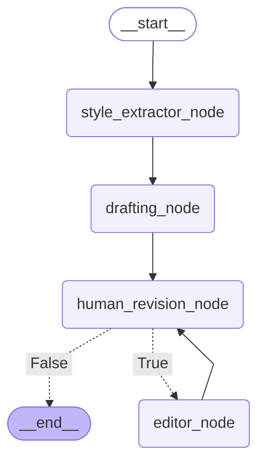
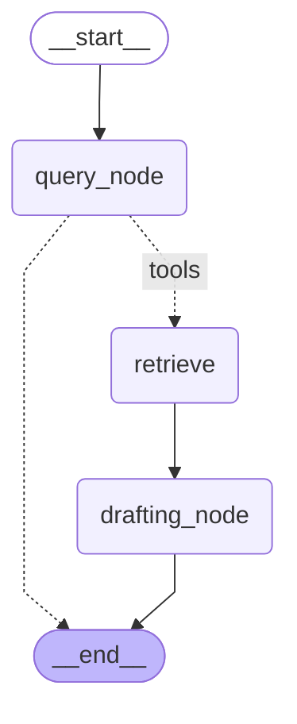

# Automated Document Preparation System

## Project Description
This project focuses on automating document preparation by combining reference documents, user inputs, and iterative human instructions.

The system:
- Parses and extracts relevant data from reference documents (PDF, DOCX).
- Generates draft reports based on predefined JSON templates.
- **NEW**: Learns writing style from example documents to generate matching content.
- Incorporates user inputs and feedback to iteratively improve document content.
- Enables end-to-end automated drafting of professional documents like technical reports or proposals.

---

## LangGraph

The system is developed on LangGraph with the following graph.



The `drafting_node` is consist of multiple subgraphs, each subgraph generate draft for one section.



## Run the Application with UV

If UV is installed.  Run this command.
```base
uv run fastapi dev main.py
```

## Installation Instructions

1. **Clone the repository**  
   ```bash
   git clone <your-repo-url>
   cd <repo-folder>
   ```

2. **Create and activate a virtual environment**  
   ```bash
   conda create -n auto-report-gen python=3.11.4
   conda activate auto-report-gen
   ```

3. **Install required libraries**  
   ```bash
   pip install -r requirements.txt
   ```

4. **Set up your API key in a `.env` file**  
   ```env
   OPENAI_API_KEY=your_api_key_here
   ```

---


## Usage Guide

1. **Activate the virtual environment**  
   ```bash
   conda activate auto-report-gen
   ```

2. **Run the application**  
   ```bash
   fastapi main.py
   ```

3. **Typical workflow**
   - Upload your reference materials.  
     *(Sample documents: `company_overview.pdf` and `SOW.docx`)*  
   - *(Optional)* **Upload an example document** to learn its writing style.
   - Click **Generate Report**.  
   - The system **extracts, maps, and generates** a draft report.  
   - **Review the generated content**:  
     - If satisfied, **download as PDF or DOCX**.  
     - If not, **suggest changes for revision**.  
   - *(Optional)* **Rate the generated content**.

4. **NEW: Example-based Style Guidance**
   - Upload an example document (PDF/DOCX) to teach the AI your preferred writing style
   - The system analyzes tone, sentence structure, terminology, and formatting
   - Generated reports will match the style of your example document
   - Perfect for maintaining brand consistency and meeting client expectations

---

## Dependencies

  - **Python 3.12**
  - **Virtual environment** (Conda optional)
  - **Libraries** (from `requirements.txt`), including:
  - ag2
  - annotated-types
  - anyio
  - appscript
  - autogen-agentchat
  - autogen-core
  - certifi
  - cffi
  - charset-normalizer
  - click
  - colorama
  - cryptography
  - diskcache
  - distro
  - dnspython
  - docker
  - docx2pdf
  - email-validator
  - fastapi
  - fastapi-cli
  - fastapi-cloud-cli
  - fpdf
  - grandalf
  - greenlet
  - h11
  - httpcore
  - httptools
  - httpx
  - idna
  - importlib-metadata
  - jinja2
  - jiter
  - jsonpatch
  - jsonpointer
  - jsonref
  - langchain
  - langchain-core
  - langchain-openai
  - langchain-text-splitters
  - langgraph
  - langgraph-checkpoint
  - langgraph-prebuilt
  - langgraph-sdk
  - langsmith
  - lxml
  - markdown-it-py
  - markupsafe
  - mdurl
  - openai
  - opentelemetry-api
  - orjson
  - ormsgpack
  - packaging
  - pdfminer-six
  - pdfplumber
  - pillow
  - protobuf
  - pyautogen
  - pycparser
  - pydantic
  - pydantic-core
  - pygments
  - pymupdf
  - pyparsing
  - pypdfium2
  - pytesseract
  - python-docx
  - python-dotenv
  - python-multipart
  - pywin32
  - pyyaml
  - regex
  - requests
  - requests-toolbelt
  - rich
  - rich-toolkit
  - rignore
  - sentry-sdk
  - shellingham
  - sniffio
  - sqlalchemy
  - starlette
  - tenacity
  - termcolor
  - tiktoken
  - tqdm
  - typer
  - typing-extensions
  - typing-inspection
  - urllib3
  - uvicorn
  - uvloop
  - watchfiles
  - websockets
  - xxhash
  - zipp
  - zstandard- ag2
  - annotated-types
  - anyio
  - appscript
  - autogen-agentchat
  - autogen-core
  - certifi
  - cffi
  - charset-normalizer
  - click
  - colorama
  - cryptography
  - diskcache
  - distro
  - dnspython
  - docker
  - docx2pdf
  - email-validator
  - fastapi
  - fastapi-cli
  - fastapi-cloud-cli
  - fpdf
  - grandalf
  - greenlet
  - h11
  - httpcore
  - httptools
  - httpx
  - idna
  - importlib-metadata
  - jinja2
  - jiter
  - jsonpatch
  - jsonpointer
  - jsonref
  - langchain
  - langchain-core
  - langchain-openai
  - langchain-text-splitters
  - langgraph
  - langgraph-checkpoint
  - langgraph-prebuilt
  - langgraph-sdk
  - langsmith
  - lxml
  - markdown-it-py
  - markupsafe
  - mdurl
  - openai
  - opentelemetry-api
  - orjson
  - ormsgpack
  - packaging
  - pdfminer-six
  - pdfplumber
  - pillow
  - protobuf
  - pyautogen
  - pycparser
  - pydantic
  - pydantic-core
  - pygments
  - pymupdf
  - pyparsing
  - pypdfium2
  - pytesseract
  - python-docx
  - python-dotenv
  - python-multipart
  - pywin32
  - pyyaml
  - regex
  - requests
  - requests-toolbelt
  - rich
  - rich-toolkit
  - rignore
  - sentry-sdk
  - shellingham
  - sniffio
  - sqlalchemy
  - starlette
  - tenacity
  - termcolor
  - tiktoken
  - tqdm
  - typer
  - typing-extensions
  - typing-inspection
  - urllib3
  - uvicorn
  - uvloop
  - watchfiles
  - websockets
  - xxhash
  - zipp
  - zstandard
